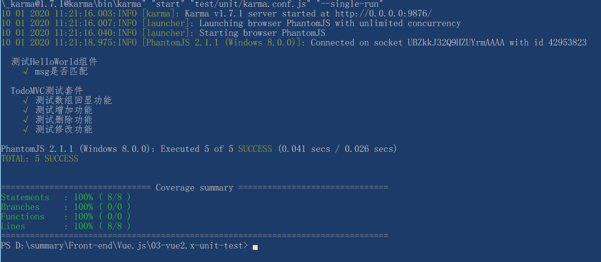

# 单元测试介绍

视频资料：B站黑马公开课（已经过时，不建议看）。

## 端到端测试

E2E 或者端到端（ End-To-End ）或者 Ul 测试是一种测试方法，它用来测试一个应用从头到尾的流程是否和设计时候所想的一样。简而言之，它从一个用户的角度出发，认为整个系统都是一个黑箱，只有 UI 会暴露给用户。

## 单元测试

测试驱动开发（TDD:Test-Driven-Development)，单元测试就不陌生。

单元测试是用来对一个模块、一个函数或者一个类来进行正确性检验的测试工作。比如写个加法函数add(a,b){return a+b}，我们可以编写出以下几个测试用例如：

输入1和1。期待返回结果是2

输入非数值类型，比如None、[]、{}，期待抛出异常。

把上面的测试用例放到一个测试模块里，就是一个完整的单元测试。

如果单元测试通过，说明我们测试的这个函数能够正常工作。如果单元测试不通过，要么函数有bug，要么测试条件输入不正确，总之，需要修复使单元测试能够通过。

那在Vue中的单元测试中主要使用两个工具分别是（Karma+Mocha)。

### Karma 介绍

Karma是一个基于 Node.js 的 Javascript 测试执行过程管理工具（Test Runner）。

该工具在Vue中的主要作用是将项目运行在各种主流Web浏览器进行测试。换句话说，它是一个测试工具，能让你的代码在浏览器环境下测试。

需要它的原因在于，你的代码可能是设计在浏览器端执行的，在node环境下测试可能有些bug暴露不出来；另外，浏览器有兼容问题，karma提供了手段让你的代码自动在多个浏览器（chrome,firefox,ie等）环境下运行。如果你的代码只会运行在node端，那么你不需要用karma。

### Mocha 介绍

+ node环境下的单元测试框架

Mocha（发音摩卡）是一个测试框架，在vue一cli中配合Mocha本身不带断言库，所以必须先引入断言库，[chai断言库](http://chaijs.com) 实现单元测试。

### 断言库

所谓“断言”，就是判断源码的实际执行结果与预期结果是否一致，如果不一致就抛出一个错误。

下面这句断言的意思是，调用add(1,l)，结果应该等于2。

var expect = require('chai').expect;
expect(l+1).to.be.equal(2);

所有的测试用例（it块）都应该含有一句或多句的断言。它是编写测试用例的关键。断言功能由断言库来实现。

## 实例

> 运行在vue-cli2.x中

```js
npm run unit

// Vue脚手架已经初始化了一个Helloworld.spec.js的测试文件去测试Hellowrold.vue，你可以在test/unit/specs/Helloworld.spec.js下找到这个测试文件．（提示：将来所有的测试文件，都将放specs这个目录下，并以测试脚本名.spec.js结尾命名！ )

```

```js
// ./test/unit/specs/HelloWorld.spec.js
import Vue from 'vue'
import HelloWorld from '@/components/HelloWorld'
// 创建测试套件，一个测试组件（.vue文件）写一个测试套件
describe('测试HelloWorld组件', () => {
  // it-测试用例 用来测试不同的的方法或者显示内容
  it('msg是否匹配', () => {
    const Constructor = Vue.extend(HelloWorld)
    const vm = new Constructor().$mount()
    expect(vm.$el.querySelector('.hello h1').textContent)
      .to.equal('Welcome to Your Vue.js App')
  })
})
/** 测试结果
  测试HelloWorld组件
    √ msg是否匹配
*/
```

**会在test\unit\coverage生成测试用例报告**

### 使用Vue官方提供的测试工具

```js
cnpm i @vue/test-utils@1.0.0-beta.12 -D
```

```html
// src\components/TodoMVC.vue
<template>
  <div class="cc">
    <section>
      <input type="text" @keyup.enter="addTodo" v-model="newtodo" class="new-todo" antofocus autocomplete="off" placeholder="请输入">
    </section>
    <section>
      <ul class="todo-list">
        <li v-for="todo in todos" :key="todo.id"  class="todo">
          <div class="view">
            <label @dblclick="edtingTodo(todo)">{{todo.text}}</label>
            <button class="destory" @click="delTodo(todo)">删除</button>
          </div>
          <input v-model="todo.text" type="text" v-show="todo === edittodo">
        </li>
      </ul>
    </section>
  </div>
</template>

<script>
export default {
  data () {
    return {
      newtodo: '',
      edittodo: '',
      todos: [
        {
          id: Math.random(),
          text: 'CSS'
        },
        {
          id: Math.random(),
          text: 'js'
        }
      ]
    }
  },
  watch: {

  },
  methods: {
    addTodo () {
      this.todos.push({
        id: Math.random(),
        text: this.newtodo
      })
      this.newtodo = ''
    },
    delTodo (todo) {
      let index = this.todos.indexOf(todo)
      this.todos.splice(index, 1)
    },
    edtingTodo (todo) {
      // 模拟编辑文本 触发更新 text
      this.edittodo = todo
    }
  }
}
</script>

<style scope>
section {
  width: 200px;
  padding: 10px;
  border: 1px solid blueviolet;
  margin-bottom: 20px;
}
.todo-list .todo {
  padding: 10px;
  border: 1px solid rosybrown;
  margin-bottom: 20px;
}

.todo-list .todo input {
  width: 120px;
}
</style>

```

```js
// \test\unit\specs/TodoMVC.spec.js
import { mount } from '@vue/test-utils'
import TodoMVC from '@/components/TodoMVC'

describe('TodoMVC测试套件', () => {
  it('测试数组回显功能', () => {
    const wrapper = mount(TodoMVC)
    // console.log(wrapper.find('.todo-list'))
    // console.log(wrapper.vm.todos)
    expect(wrapper.vm.todos.length).to.be.equal(2)
  })

  it('测试增加功能', () => {
    const wrapper = mount(TodoMVC)
    // 对 newtodo 进行赋值
    wrapper.setData({
      newtodo: 'test'
    })
    // 对 new-todo 模拟发出回车事件
    wrapper.find('.new-todo').trigger('keyup.enter')
    // 检查 todos 新增的数据是否正确
    expect(wrapper.vm.todos[2].text).to.be.equal('test')
  })

  it('测试删除功能', () => {
    const wrapper = mount(TodoMVC)
    wrapper.find('.destory').trigger('click')
    expect(wrapper.vm.todos.length).to.be.equal(1)
  })

  it('测试修改功能', () => {
    const wrapper = mount(TodoMVC)
    let li = wrapper.find('li')
    li.find('label').trigger('dblclick')
    // let input = li.find('input')
    // console.log(li.classes()) // 查看 li 上面的 class
    expect(wrapper.vm.edittodo).to.have.property('id')
  })
})

```

`运行 npm run unit：`



`其他注意事项`

```js
// Karma 不支持 es6 语法，需要npm对应的包
// 比如 es6-set es6-promise
// test\unit\index.js 需要set polyfill
import 'es6-set/implement'
```
