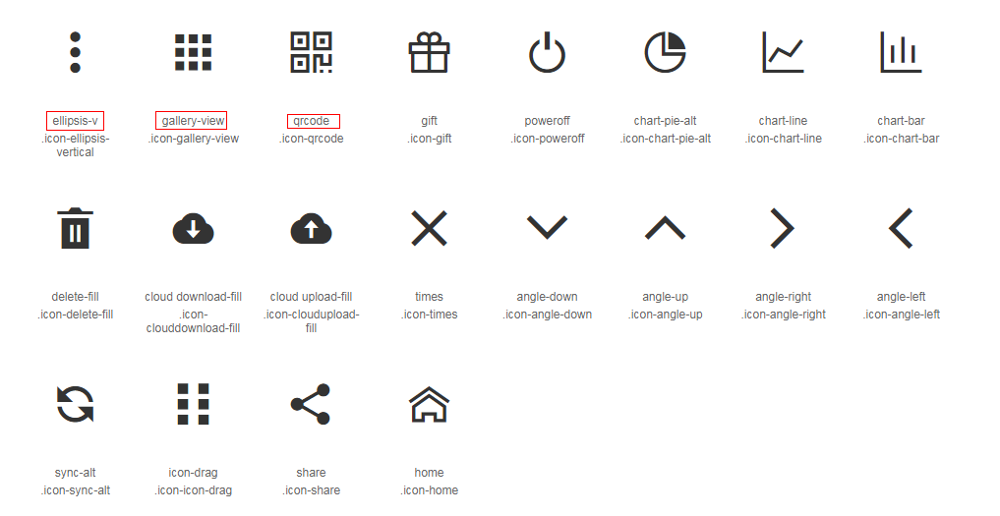

# Header组件说明

**引入：**

```js
import header from './components/Header/index.js'
Vue.use(header)
```

**使用：**

```html
<header-component></header-component>
```

**配置：**

```html
<header-component
  :title="title"
  :border="border"
  :description="description"
  :instruction="instruction"
  @method="getActive"
>
</header-component>

<script>
export default {
  data() {
    return {
      title: '主页', // String header的标题 非必填
      border: true, // Boolean header的底边框 非必填
      description: '', // String header的描述信息 非必填
      instruction: '', // String header的功能显示 非必填
    }
  },
  methods: {
    // 当 instruction 显示时的回调函数
    getActive() {
      console.log('your code ...')
    }
  }
}
</script>
```


**instruction介绍：**

[图标源于阿里矢量图标](https://www.iconfont.cn/)

> 红色框为`instruction`的值，设置为其他值时将不显示。

